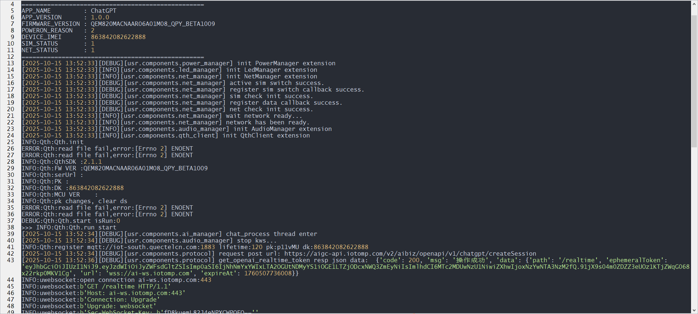

# QuecPython ChatGPT-Based AI Chatbot

## Table of Contents

- Introduction
- Features
- Quick Start
  - Prerequisites
  - Installation
  - Running the Application
- Contributing
- License
- Support

## Introduction

QuecPython introduces a ChatGPT AI chatbot solution. This solution is based on the WebSocket protocol, offers cross-platform capabilities, and is compatible with most QuecPython modules.

This case uses an AI development board equipped with the EM820MACNAA module.

## Features

- Supports voice interruption/barge-in.
- Supports keyword wake-up via voice or button press.
- Supports multi-language conversation.
- Uses Python language, facilitating secondary development.

## Quick Start

### Prerequisites

Before you begin, ensure you have the following prerequisites:

- **Hardware:**
  - Contact Quectel official to obtain the AI development board and accessories.
  - Computer (Windows 7, Windows 10, or Windows 11)
- **Software:**
  - Debugging tool [QPYcom](https://images.quectel.com/python/2022/12/QPYcom_V3.6.0.zip)
  - QuecPython firmware (Corresponding firmware is available in the `fw` directory of the repository)
  - Python text editor (e.g., [VSCode](https://code.visualstudio.com/), [Pycharm](https://www.jetbrains.com/pycharm/download/))

### Installation

1. **Clone the repository:**

   bash

   ```
   git clone https://github.com/QuecPython/solution-ChatGPT
   ```

   

2. **Flash the firmware:**
   Follow the instructions at [Firmware Flashing - QuecPython](https://developer.quectel.com/doc/quecpython/Getting_started/en/Wi-Fi/flash_firmware.html) to flash the firmware onto the development board.

### Running the Application

1. **Connect the hardware:**
   This case uses the Quectel AI Development Board. Please contact the official if needed.

   

2. **Connect to the host computer via Type-C.**

3. **Download the code to the device:**

   - Start the [QPYcom](https://images.quectel.com/python/2022/12/QPYcom_V3.6.0.zip) debugging tool.
   - Connect the data cable to your computer.
   - Press the **PWRKEY** button on the development board to power on the device.
   - Follow the [instructions](https://developer.quectel.com/doc/quecpython/Getting_started/en/4G/first_python.html#File-Transfer-between-PC-and-Module) to upload all files from the `code` folder to the module's file system, preserving the directory structure.

4. **Run the application:**

   - Select the `File` tab.
   - Select the `_main.py` script.
   - Right-click and select `Run` or use the `Run` quick button to execute the script.

5. **After wake-up by keyword, you can start a conversation. Refer to the run log:**

   


## Contributing

We welcome contributions to improve this project! Please follow these steps to contribute:

1. Fork this repository.
2. Create a new branch (`git checkout -b feature/your-feature`).
3. Commit your changes (`git commit -m 'Add your feature'`).
4. Push to the branch (`git push origin feature/your-feature`).
5. Open a Pull Request.

## License

This project is licensed under the Apache License. See the [LICENSE](https://license/) file for details.

## Support

If you have any questions or need support, please refer to the [QuecPython Documentation](https://python.quectel.com/doc) or open an issue in this repository.
